
# 🛒 E-Commerce Web Application (ASP.NET MVC)

This is a full-featured **E-Commerce Web Application** developed using **ASP.NET MVC** (.NET Framework 4.7.2) in **Visual Studio 2022**.  
The project includes two main parts:
- **Admin Panel** for managing products, orders, categories, brands, colors, and sizes.
- **Client Side** where customers can browse products, add to wishlist or cart, and place orders.

The application uses **Stored Procedures** for efficient database operations.

---

## 🛠️ Technologies Used

- **ASP.NET MVC** (.NET Framework 4.7.2)
- **Visual Studio 2022**
- **MS SQL Server** (Stored Procedures)
- **Entity Framework**
- **HTML, CSS, Bootstrap**
- **jQuery / AJAX**

---

## 📂 Project Modules

### 🔑 Admin Panel

- **Authentication:** Admin login, account creation, and forgot password.
- **Dashboard:** View total, pending, rejected, and approved orders.
- **Profile:** View admin general details.
- **Category Management:** Add and view categories.
- **Subcategory Management:** Add and view subcategories.
- **Brand Management:** Add and view brands.
- **Color Management:** Add and view colors.
- **Size Management:** Add and view sizes.
- **Product Management:** Add products and view the product list.
- **Order Management:** View orders, approve/reject/pending actions, and view detailed order information.

### 🛍️ Client Side

The client-side of the application provides an intuitive, user-friendly interface for customers to browse products, manage their cart and wishlist, and complete their orders. Below is the detailed flow of the **Client Side**:

#### 1. **Client Authentication:**
   - **Signup:** Clients can create a new account with their details.
   - **Login:** Once the signup is successful, clients are redirected to the login page. There is a **forgot password** link that helps clients reset their password if necessary. After logging in successfully, clients are redirected to the **main page** of the website.

#### 2. **Viewing Products:**
   - **Guest Access:** Clients can browse products without being logged in. However, to make a purchase or add items to the cart or wishlist, they need to log in.
   - **Product Categories:** On the homepage, clients can see products organized in different categories, brands, colors, and sizes.
   - **Product Types:** 
     - **New Products:** Products that are newly added and do not have any discounts.
     - **Sale Products:** Products with active discounts or sale offers.
   - **Product Details:** Clients can view basic details of products. Each product has buttons for:
     - **Add to Cart** – Adds the product to the shopping cart.
     - **Add to Wishlist** – Saves the product in the wishlist for future purchase.
     - **More Details** – Displays a page with complete details of the product, including related products from the same brand.

#### 3. **Wishlist:**
   - Clients can add products to their wishlist by clicking the **Add to Wishlist** button.
   - The wishlist can be accessed from the top right of the page. Clients can add any product from the wishlist to the cart, and once the product is added to the cart, it is removed from the wishlist.

#### 4. **Cart Management:**
   - In the **Cart**, clients can view all products they have added. The cart shows the product details and allows the client to modify the quantity of each product.
   - Clients can choose to **continue shopping** or proceed to checkout.
   - **Checkout:** When the client clicks the checkout button, a page opens where:
     - The products in the cart are displayed.
     - The client provides their shipping information.
     - The client selects the **payment method** and **confirms the order**.
   - Once the order is confirmed, it is stored in the system and visible to the admin in the **Order List** for further processing.

#### 5. **Order Confirmation:**
   - After placing the order, the client is shown an order confirmation message. The order is then displayed in the **Order List** on the admin side where the admin can manage the order (approve/reject).

---

## 💡 Features Summary

- 🔒 Secure authentication for admin and clients.
- 🧩 Modular management of categories, products, brands, colors, and sizes.
- 🛍️ User-friendly client interface with filtering and sorting.
- 🧾 Dynamic order processing and management.
- 🗃️ Database operations handled via stored procedures for better performance.

---

## 🤝 Contributing

Pull requests are welcome. For major changes, please open an issue first to discuss what you would like to change.

---

# SCREENSHOTS OF Website

## Admin Login
Here is a screenshot of the **Admin Login**:

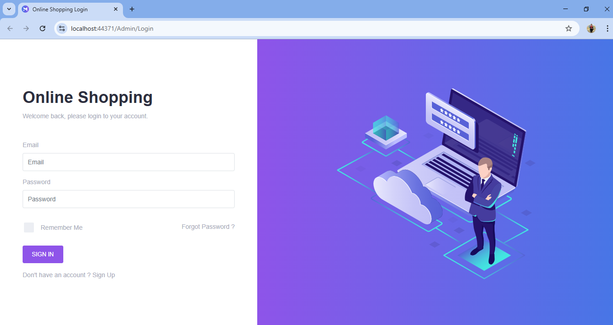

## Admin Dashboard
Here is a screenshot of the **Admin Dashboard**:

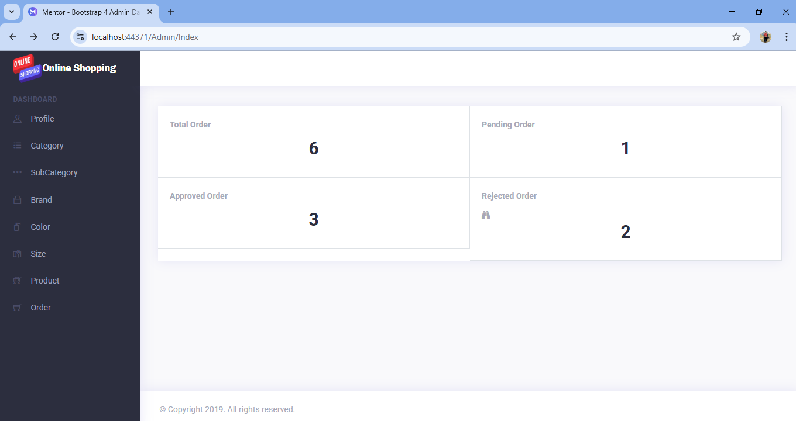

## Category
Here is a screenshot of the **Categories**:

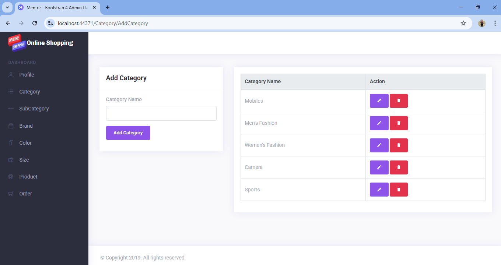

## Sub Categories
Here is a screenshot of the **Sub Categories**:

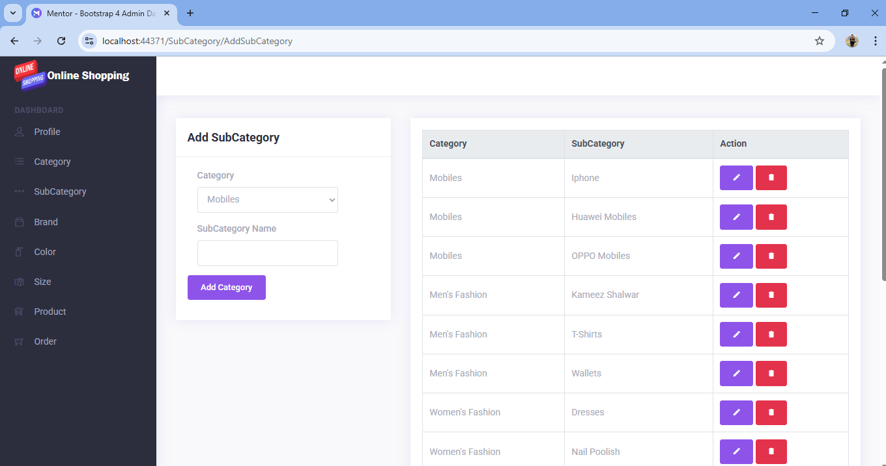

## Brand
Here is a screenshot of the **Brand**:

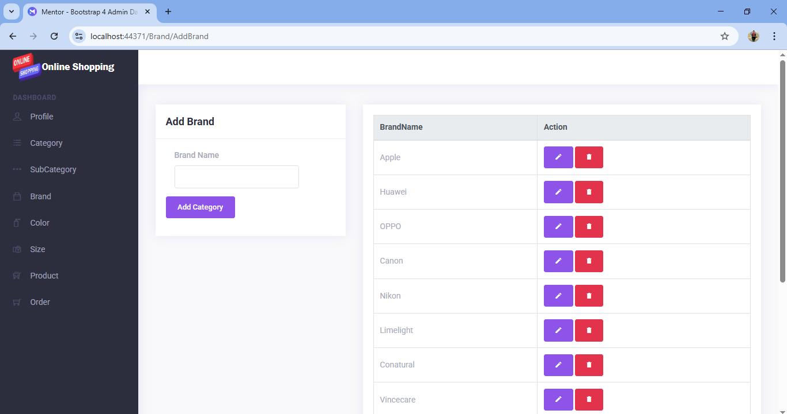

## Color
Here is a screenshot of the **Color**:

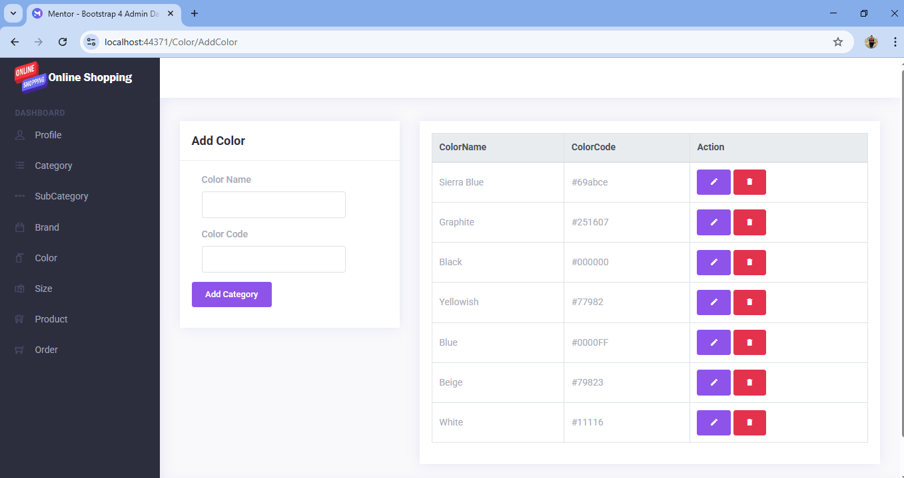

## Products
Here is a screenshot of the **Products**:

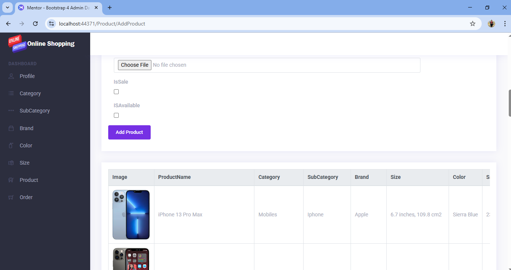

## OrdersList
Here is a screenshot of the **OrdersList**:

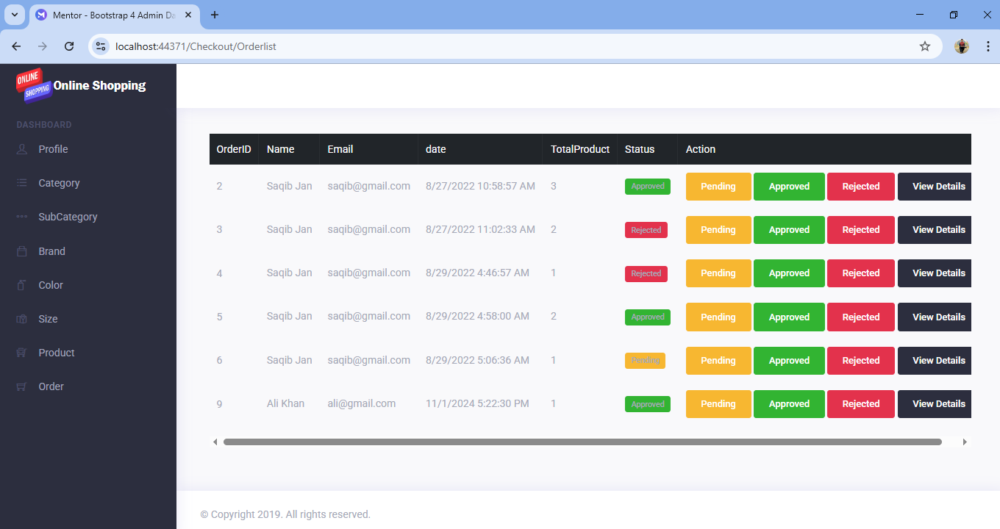

## Client Login
Here is a screenshot of the **Client Login**:

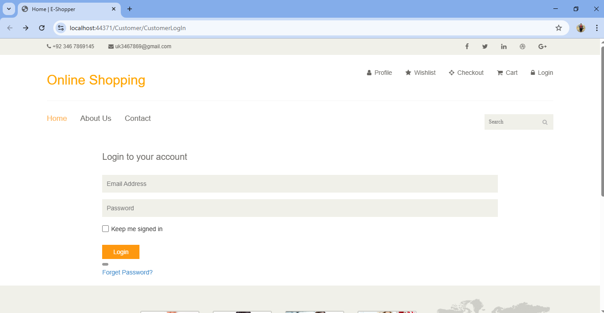

## Main page
Here is a screenshot of the **Main page**:

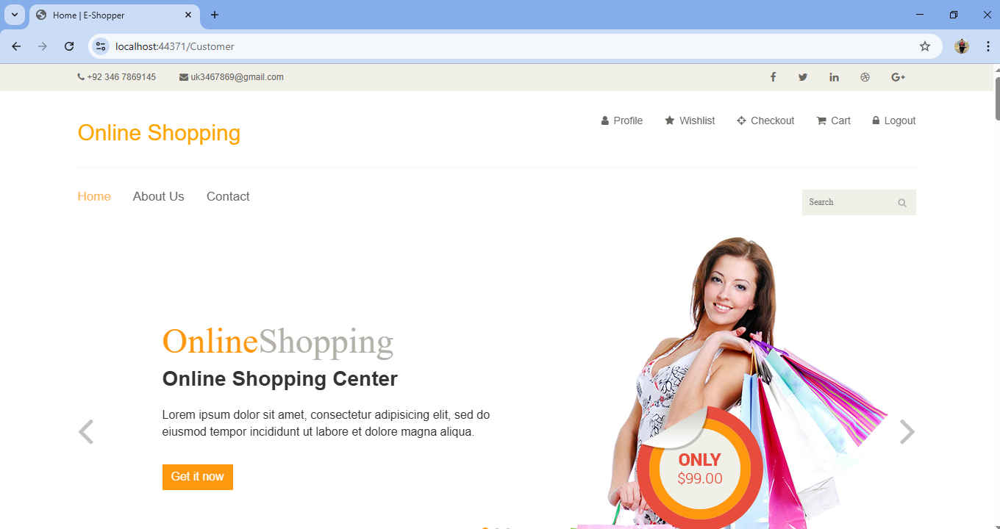

## Main Page Products Section
Here is a screenshot of the **Main Page Products Section**:

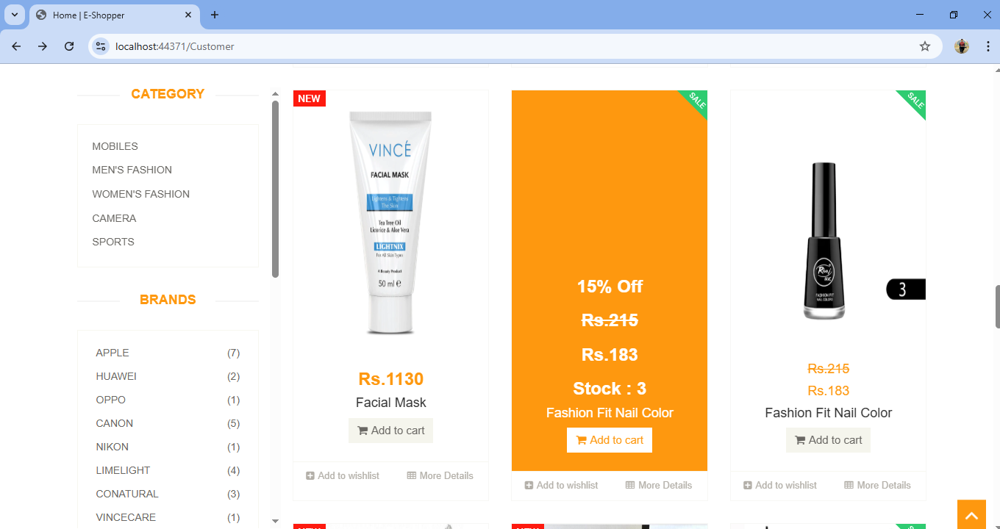

## Product Details
Here is a screenshot of the **Product Details**:

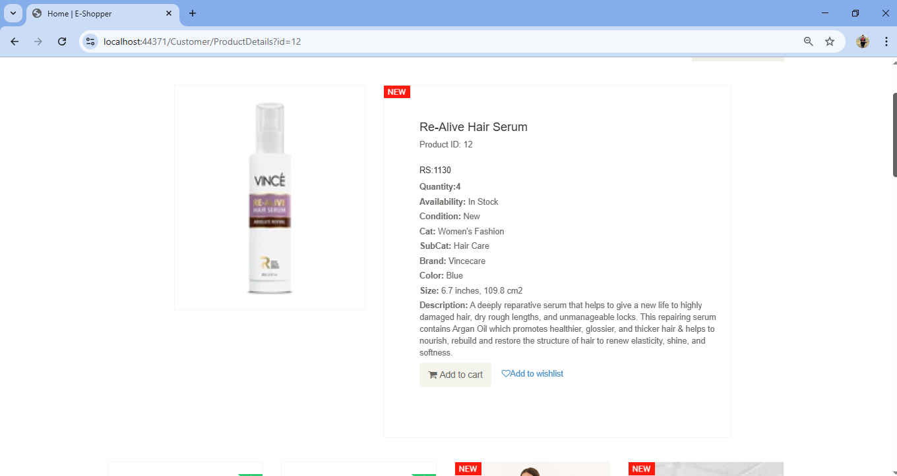

## Wishlist
Here is a screenshot of the **Wishlist**:

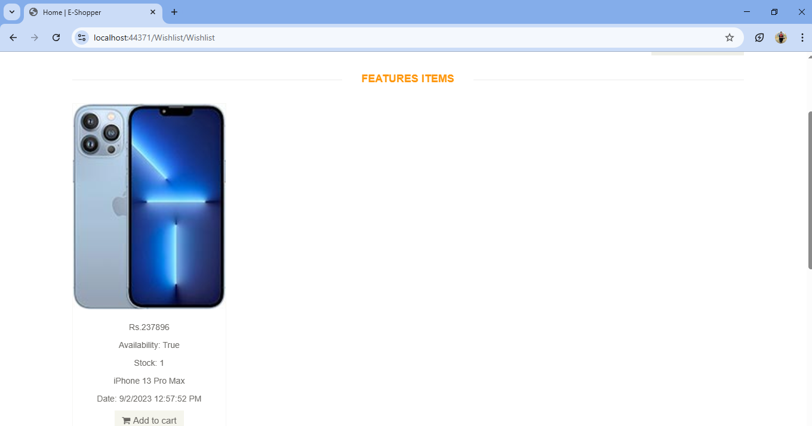

## Cart
Here is a screenshot of the **Cart**:

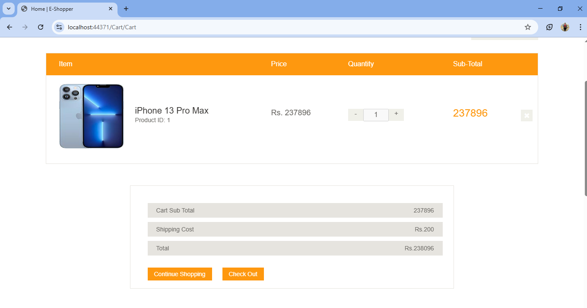

## CheckOut
Here is a screenshot of the **CheckOut**:

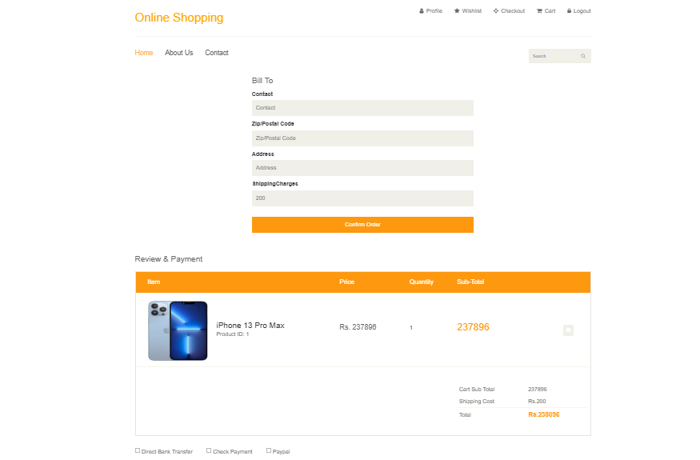

